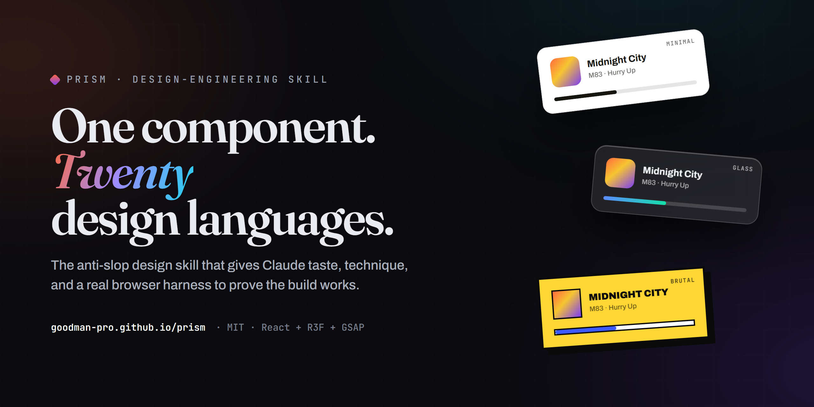

# prism

<a href="https://goodman-pro.github.io/prism/examples/style-atlas/"></a>

**The unified design-engineering skill for building award-grade, immersive websites and web interfaces — for [Claude Code](https://docs.claude.com/en/docs/claude-code) and Claude agents.**

### ▶ Live demo — [the style atlas](https://goodman-pro.github.io/prism/examples/style-atlas/)
One component rendered in **twenty** design languages, with a real working seek bar → **https://goodman-pro.github.io/prism/examples/style-atlas/**

prism is a single skill that gives Claude the *taste* and the *technique* to design and build premium frontends — and then a real browser harness to **prove** the build works. It's the single source of truth for UI, visual design, motion, and immersive 3D, and it supersedes scattered "make it pretty" prompting.

Stack it targets: **React + React Three Fiber + Three.js + GSAP + Lenis + Motion + GLSL.**

---

## Why it's different

Most "design" prompts produce the same AI-default look — Inter/Space-Grotesk, purple gradients, glowing cards, icon-tile features. prism is **anti-slop by construction**:

- **A craft bible (`craft.md`)** that draws the hard line between *slop* (looks AI-default) and *demo-ware* (looks fine, doesn't actually work) — every build has to beat **both**, with a self-audit you run on your own output before "done."
- **5 design-language presets + a variance engine** so two builds don't land on the same look (Ethereal Glass, Editorial Minimal, Industrial Brutalist, Soft Structural, Immersive Cinematic).
- **Real reference, not vibes** — committed docs for foundations (type/color/space/grid), component patterns (nav, hero, bento, cards, forms, modals, pricing…), motion & micro-interactions, immersive 3D/WebGL/shaders, performance budgets, and redesign auditing.
- **A committed verify harness (`driver.mjs`)** — it launches your built site in real headless Chromium and drives it through the prism checks: horizontal-overflow sweep at 5 widths, console/page errors, a screenshot of **every GSAP ScrollTrigger pin**, mobile reframe, and `prefers-reduced-motion`. Code that clicks the button, not a markdown checklist that pretends to.

> A clean console is not a good-looking page. prism finds the *technical* faults; you still read the screenshots.

**See it live:** [▶ the style atlas →](https://goodman-pro.github.io/prism/examples/style-atlas/) · [source](./examples/style-atlas/) — the same "now playing" card rendered in **twenty** design languages (Minimalism · Glassmorphism · Liquid Glass · Neo-Brutalism · Claymorphism · Skeuomorphism · Neumorphism · Aurora · Terminal · Synthwave · Material · Cyberpunk · Swiss · Bauhaus · Memphis · Frutiger Aero · Editorial · Maximalism · Acid · Spatial), with a real working seek bar. One skeleton, twenty souls.

---

## What's inside

```
prism/
├─ SKILL.md                  # the router — when to use what, the build procedure, the preflight
├─ driver.mjs                # the browser verify harness (headless Chromium)
├─ reference/
│  ├─ craft.md               # the 0%-slop / production-grade bible — the quality spine
│  ├─ foundations.md         # type, color, spacing, grid, the anti-slop tells
│  ├─ components.md          # nav · hero · bento · cards · forms · modals · marquee · footer · pricing
│  ├─ motion.md              # GSAP + ScrollTrigger + Lenis + Motion; micro-interactions
│  ├─ immersive-3d.md        # R3F / Three.js / WebGL / GLSL shaders / postprocessing; 3D tiers 0–3
│  ├─ performance.md         # Core Web Vitals, budgets, lazy 3D, image strategy
│  ├─ design-languages.md    # the 5 presets + the variance engine
│  ├─ resources.md           # license-flagged asset & component sources (3D, fonts, registries…)
│  ├─ redesign.md            # auditing & upgrading an existing site
│  ├─ preflight.md           # the ship checklist
│  └─ verify.md              # how to drive driver.mjs
└─ examples/
   └─ style-atlas/           # one component, twenty design languages (open index.html)
```

---

## Install

Clone it into your Claude skills directory, then restart Claude Code (skills register at startup).

**macOS / Linux**
```bash
git clone https://github.com/GOODMAN-PRO/prism ~/.claude/skills/prism
```

**Windows (PowerShell)**
```powershell
git clone https://github.com/GOODMAN-PRO/prism "$env:USERPROFILE\.claude\skills\prism"
```

Restart Claude Code. Then trigger it with **`/prism`**, or just ask for design/frontend work — it auto-loads on matching tasks (landing pages, portfolios, UI, dashboards, hero sections, 3D/WebGL, motion, redesigns).

---

## The verify harness

After a build, run the driver against your site before declaring done:

```bash
node ~/.claude/skills/prism/driver.mjs "http://localhost:5173/" --out ./prism-verify
```

- Pass a **dev-server URL**, or a **local path** (a directory with `index.html`, or an `.html` file → opened via `file://`).
- `--out` screenshot dir (default `./prism-verify`), `--shots N` desktop scroll-depths (default 5).
- It prints `PASS`/`FAIL` and saves screenshots you should actually open.

**Playwright** (the driver needs it):
```bash
npm i -D playwright && npx playwright install chromium
```
Or set `PRISM_PW` to any directory whose `node_modules` already has Playwright. Headless WebGL/canvas renders via `--use-angle=swiftshader`, so 3D/canvas builds show up in the screenshots.

---

## License

[MIT](./LICENSE) — use it, fork it, ship with it.
